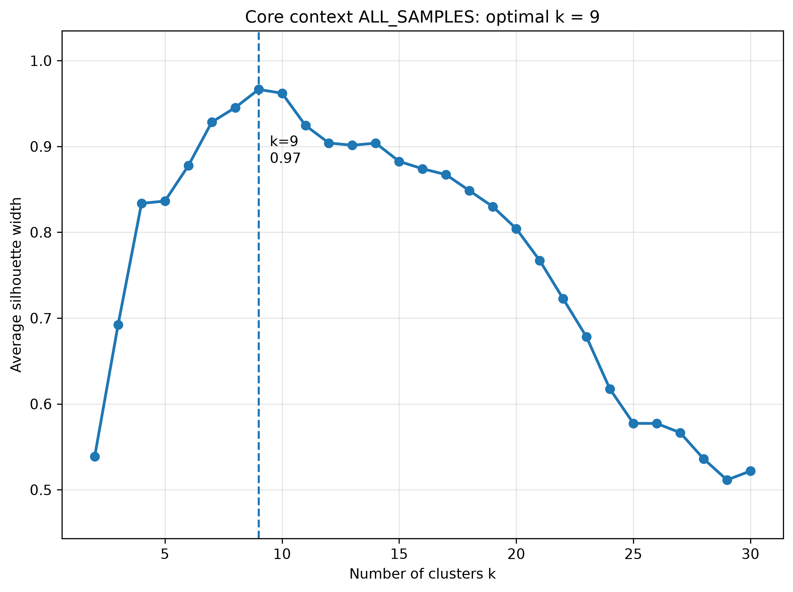
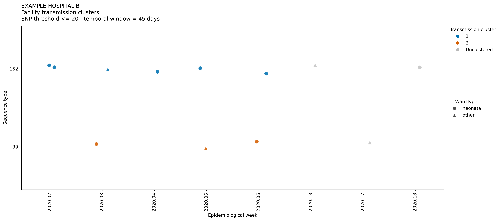
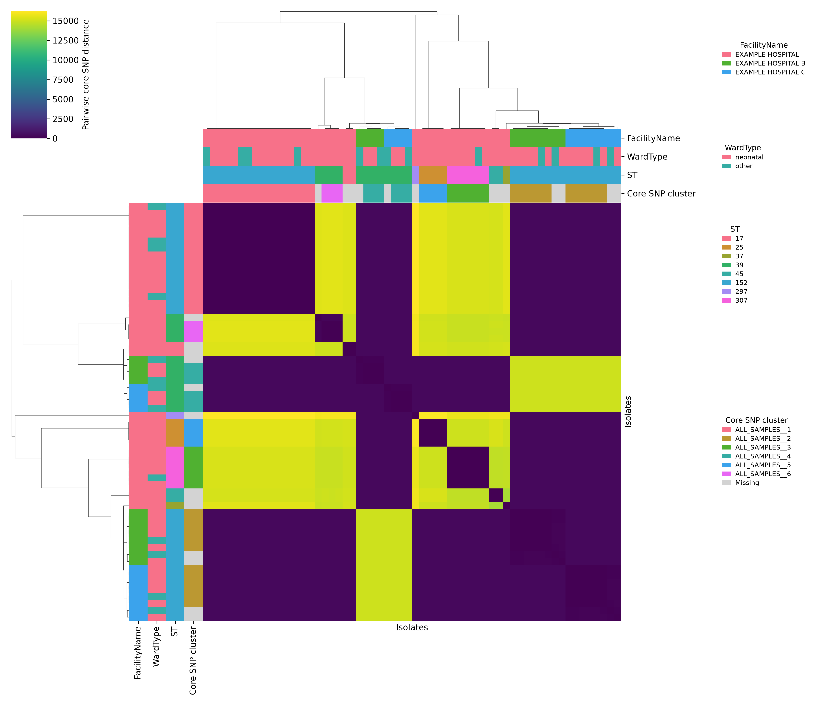
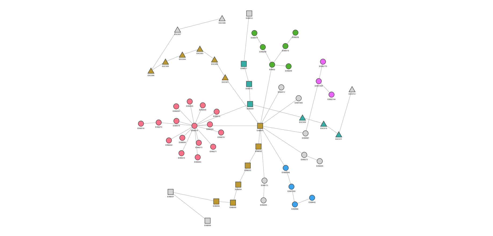
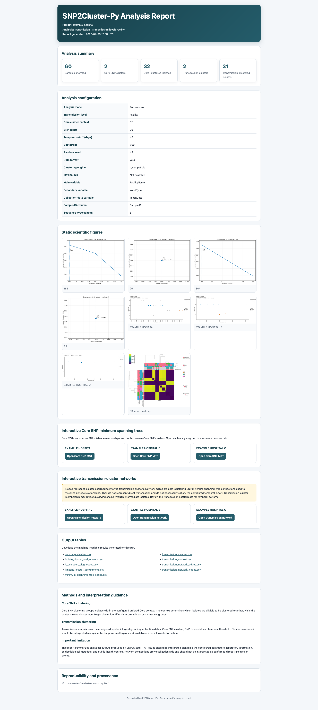

# SNP2Cluster-Py

[](https://doi.org/10.5281/zenodo.23045861)

**A pathogen-agnostic, context-aware SNP clustering framework for transmission-cluster detection**

SNP2Cluster-Py is an open-source Python application for reproducible genomic clustering and transmission-cluster analysis from pairwise core SNP distances, epidemiological metadata, sequence types, collection dates, and configurable analytical contexts.

The tool provides a tested Python implementation of the SNP2Cluster analytical workflow, including R-compatible Core SNP clustering, SNP-Epi transmission clustering, context-aware analysis, publication-supporting visualizations, machine-readable tables, audit records, and an open scientific HTML report.


## Table of Contents
- [Version 1 scope](#version-1-scope)
- [Scientific purpose](#scientific-purpose)
- [Analysis workflow](#analysis-workflow)
- [Installation](#installation)
- [Quick start](#quick-start)
- [Example configuration](#example-configuration)
- [Core clustering contexts](#core-clustering-contexts)
- [Canonical Core cluster identifiers](#canonical-core-cluster-identifiers)
- [Analysis modes](#analysis-modes)
- [Input formats](#input-formats)
- [Date parsing](#date-parsing)
- [Output structure](#output-structure)
- [Visual outputs](#visual-outputs)
- [Open scientific HTML report](#open-scientific-html-report)
- [Validation and testing](#validation-and-testing)
- [Reproducibility](#reproducibility)
- [Citation](#citation)
- [Public open-source and commercial development](#public-open-source-and-commercial-development)
- [Contributing](#contributing)
- [Security and responsible use](#security-and-responsible-use)
- [License](#license)
- [Acknowledgements](#acknowledgements)


## Version 1 scope

Version 1 provides the complete open scientific analysis layer:

- Core SNP clustering
- SNP-Epi transmission-cluster detection
- R-compatible analytical behavior
- Core-only and Transmission analysis modes
- Facility, Area, and Community transmission levels
- Ordered context-aware Core SNP clustering
- Configurable sample, metadata, date, and MLST mappings
- Canonical context-aware Core cluster identifiers
- K-selection diagnostics
- Transmission scatterplots
- Annotated Core SNP heatmaps
- Interactive Core SNP minimum spanning trees
- Interactive transmission-cluster networks
- CSV tables, audit records, and run manifests
- Open scientific HTML run reports
- Reproducible command-line execution through YAML configuration

<p align="right"><a href="#table-of-contents">⬆ Back to top</a></p>

## Scientific purpose

SNP2Cluster-Py supports two related analytical questions:

1. **Core SNP clustering:** Which isolates form genetically coherent SNP clusters within a configured biological or epidemiological context?
2. **Transmission clustering:** Which Core-clustered isolates also satisfy configured epidemiological grouping and temporal criteria for inferred transmission-cluster membership?

The software does not infer confirmed direct transmission. Network edges are visualization aids and must be interpreted alongside the configured parameters, epidemiological metadata, collection dates, and transmission scatterplots.

<p align="right"><a href="#table-of-contents">⬆ Back to top</a></p>

## Analysis workflow

```text
Input validation and normalization
        |
        v
Canonical metadata enrichment
        |
        v
Ordered Core clustering context
        |
        v
Context-specific Core SNP clustering
        |
        +----------------------+
        |                      |
        v                      v
Core outputs          Optional Transmission analysis
        |                      |
        v                      v
Heatmaps and MSTs     Scatterplots and networks
        |                      |
        +-----------+----------+
                    |
                    v
        Tables, audit records, and HTML report
```
<p align="right"><a href="#table-of-contents">⬆ Back to top</a></p>

## Installation

**Prerequisite:** SNP2Cluster-Py requires Python 3.10 or higher.

Clone the repository and install the package in an isolated Python environment. When creating the virtual environment, ensure you invoke a compatible Python version (e.g., `python3` or `python3.10`).

```bash
git clone https://github.com/stanikae/snp2cluster-py.git
cd snp2cluster-py

# Create the environment using Python 3.10+
python3.10 -m venv .venv
source .venv/bin/activate

python -m pip install --upgrade pip
python -m pip install -e .
```

For development and testing:

```bash
python -m pip install -e ".[dev]"
python -m pytest -q
```
<p align="right"><a href="#table-of-contents">⬆ Back to top</a></p>

## Quick start

Validate a configuration:

```bash
python -m src.snp2cluster.cli validate \
    --config configs/example_config.yaml
```

Run an analysis:

```bash
python -m src.snp2cluster.cli run \
    --config configs/example_config.yaml
```
<p align="right"><a href="#table-of-contents">⬆ Back to top</a></p>

## Example configuration

```yaml
project:
  name: example_hospital
  run_id: null

inputs:
  metadata: validation/example_data/example_metadata.csv
  snp_matrix: validation/example_data/coreSNPmatrix.co.csv
  mlst_profile: validation/example_data/05.mlst.xlsx

columns:
  sample_id: SampleID
  sequence_type: ST
  st_sample_id: FILE

variables:
  main_var: FacilityName
  var_01: WardType
  var_02: TakenDate

analysis:
  cluster_type: Transmission
  transmission_level: Facility
  core_cluster_context: [ST]
  snp_cutoff: 20
  days_cutoff: 45
  n_bootstraps: 500
  random_seed: 42
  date_format: ymd
  max_k: null
  engine: r_compatible

outputs:
  out_dir: runs
  generate_excel: true
  generate_figures: true
  generate_html_report: true
```
<p align="right"><a href="#table-of-contents">⬆ Back to top</a></p>

## Core clustering contexts

`core_cluster_context` is an ordered list that controls which isolates may participate in Core SNP clustering together.

Supported tokens:

| Token | Meaning |
|---|---|
| `Global` | Analyse all eligible isolates in one Core clustering context |
| `ST` | Separate Core clustering by sequence type |
| `MainVar` | Separate Core clustering by `variables.main_var` |
| `SecondaryVar` | Separate Core clustering by `variables.var_01` |

Examples:

```yaml
core_cluster_context: [Global]
core_cluster_context: [ST]
core_cluster_context: [MainVar]
core_cluster_context: [MainVar, ST]
core_cluster_context: [MainVar, SecondaryVar]
core_cluster_context: [MainVar, SecondaryVar, ST]
```

Context order is significant. For example:

```yaml
core_cluster_context: [MainVar, ST]
```

may create contexts such as:

```text
Hospital_A__152
Hospital_A__307
Hospital_B__152
```

whereas:

```yaml
core_cluster_context: [ST, MainVar]
```

may create:

```text
152__Hospital_A
152__Hospital_B
307__Hospital_A
```
<p align="right"><a href="#table-of-contents">⬆ Back to top</a></p>

## Canonical Core cluster identifiers

The final Core output includes:

- `_core_context`: the ordered context used for Core clustering
- `snp_cluster_id`: the cluster identifier local to that context
- `core_snp_cluster`: the globally interpretable identifier formed from the context and local cluster ID

Example:

```text
_core_context              snp_cluster_id    core_snp_cluster
152                        1                 152__1
Hospital_A__152            1                 Hospital_A__152__1
ALL_SAMPLES                3                 ALL_SAMPLES__3
```

Samples without a retained Core cluster remain in the complete Core annotation output with missing `snp_cluster_id` and `core_snp_cluster` values.

<p align="right"><a href="#table-of-contents">⬆ Back to top</a></p>

## Analysis modes

### Core mode

```yaml
analysis:
  cluster_type: Core
```

Core mode performs context-aware clustering from the SNP distance matrix. Depending on the selected context, metadata and sequence type information may also be required.

### Transmission mode

```yaml
analysis:
  cluster_type: Transmission
  transmission_level: Facility
```

Transmission mode builds on the Core clustering results and incorporates:

- Epidemiological grouping
- Collection dates
- SNP thresholds
- Temporal thresholds
- Core SNP cluster membership

Supported transmission levels are:

- `Facility`
- `Area`
- `Community`

<p align="right"><a href="#table-of-contents">⬆ Back to top</a></p>

## Input formats

Supported tabular formats include:

- CSV
- TSV
- XLS
- XLSX
- XLSM
- Parquet

Column names are configured in YAML and are not hardcoded.

<p align="right"><a href="#table-of-contents">⬆ Back to top</a></p>

## Date parsing

Date parsing is configuration-driven:

```yaml
analysis:
  date_format: ymd
```

Supported values include:

```text
ymd
ydm
dmy
mdy
```
<p align="right"><a href="#table-of-contents">⬆ Back to top</a></p>

## Output structure

Each run creates a structured output directory:

```text
runs/<project>_<run_id>/
├── audit/
│   ├── run_manifest.json
│   └── validation_log.txt
├── tables/
│   ├── core_snp_clusters.csv
│   ├── isolate_cluster_assignments.csv
│   ├── kmeans_cluster_assignments.csv
│   ├── k_selection_diagnostics.csv
│   ├── minimum_spanning_tree_edges.csv
│   ├── transmission_clusters.csv
│   ├── transmission_context.csv
│   ├── transmission_network_nodes.csv
│   └── transmission_network_edges.csv
├── figures/
│   ├── 01_k_selection*.png
│   ├── 02_transmission_scatter*.png
│   ├── 03_core_heatmap*.png
│   ├── 04_mst_*.html
│   └── 05_transmission_network_*.html
└── report/
    └── snp2cluster_report.html
```

Outputs vary by analysis mode and configuration.

<p align="right"><a href="#table-of-contents">⬆ Back to top</a></p>

## Visual outputs

### K-selection diagnostics
Summarize candidate values of k and the selected Core clustering solution.


### Transmission scatterplots
Display clustered and unclustered isolates across epidemiological time and configured analysis groups.


### Annotated Core SNP heatmaps
Display pairwise SNP distances together with Core cluster and metadata annotations.


### Core SNP minimum spanning trees
Display sparse genetic relationships among all eligible samples in the selected visualization group.
* Clustered samples are coloured by core_snp_cluster.
* Samples without retained Core cluster assignments are shown in grey.
* Global context produces an all-sample MST and retains main_var drill-down MSTs.
* Non-Global contexts produce main_var-specific MSTs.



### Transmission-cluster networks
Display isolates already assigned to inferred transmission clusters.
Network edges are post-clustering SNP minimum-spanning-tree connections for visualizing genetic relationships. They do not represent confirmed direct transmission and do not necessarily satisfy the configured temporal cutoff. Use the corresponding transmission scatterplots for temporal interpretation.


<p align="right"><a href="#table-of-contents">⬆ Back to top</a></p>

## Open scientific HTML report

The HTML report provides a navigable index of each run, including:
* Analysis summary metrics
* Configuration and analytical thresholds
* Embedded static figures
* Links to interactive MSTs and transmission networks
* Links to machine-readable output tables
* Methods and interpretation guidance
* Reproducibility and provenance information when available

The report does not generate automated outbreak interpretations, risk scores, clinical recommendations, or operational alerts.


<p align="right"><a href="#table-of-contents">⬆ Back to top</a></p>

## Validation and testing

Run the test suite with:

```bash
python -m pytest -q
```

Run basic source validation with:

```bash
python -m py_compile \
    src/snp2cluster/pipeline.py \
    src/snp2cluster/visualization/mst.py \
    src/snp2cluster/visualization/networks.py \
    src/snp2cluster/report.py

git diff --check
```

The repository includes example configurations for Global, ST-aware, Facility, Area, Community, Core-only, and Transmission workflows.

<p align="right"><a href="#table-of-contents">⬆ Back to top</a></p>

## Reproducibility

SNP2Cluster-Py supports reproducible analyses through:

- Configuration-controlled execution
- Fixed random seeds
- Explicit SNP and temporal thresholds
- R-compatible analytical behavior
- Structured output directories
- Run manifests
- Validation logs
- Machine-readable result tables
- Versioned software releases

<p align="right"><a href="#table-of-contents">⬆ Back to top</a></p>

## Citation

The recommended title for the Version 1 software record and manuscript is:

> **SNP2Cluster-Py: A pathogen-agnostic and context-aware SNP clustering framework for transmission-cluster detection**

To cite this software, please use the "Cite this repository" button in the GitHub sidebar to generate the correct format for your reference manager, or refer to the `CITATION.cff` file in this repository.

The original SNP2Cluster software record is:

> Kwenda S, Shuping L, Mashau R, Ismail H, Govender NP. SNP2Cluster: A core SNP and K-means clustering-based tool for enhanced transmission-cluster detection in outbreak scenarios. Zenodo, 2024. DOI: 10.5281/zenodo.14060296.

<p align="right"><a href="#table-of-contents">⬆ Back to top</a></p>

## Contributing

Contributions are welcome through GitHub issues and pull requests. Before contributing:

1. Create a feature branch from the default development branch.
2. Add or update tests for behavioral changes.
3. Run the complete test suite.
4. Run `git diff --check`.
5. Document user-facing changes.

Please refer to `CONTRIBUTING.md` for more detailed guidelines.

<p align="right"><a href="#table-of-contents">⬆ Back to top</a></p>

## Security and responsible use

Do not commit identifiable patient information, confidential surveillance records, credentials, access tokens, or restricted institutional data.

Users are responsible for ensuring that input data use complies with applicable ethics approvals, data-governance requirements, institutional policies, and relevant laws.

SNP2Cluster-Py outputs support genomic epidemiology and outbreak investigation. Outputs should not be treated as standalone evidence of direct transmission, source attribution, or clinical causality.

<p align="right"><a href="#table-of-contents">⬆ Back to top</a></p>

## License

This project is licensed under the Apache License 2.0. See the `LICENSE` file for details. This provides permissive reuse terms and an explicit patent grant for the open scientific analysis layer.

<p align="right"><a href="#table-of-contents">⬆ Back to top</a></p>

## Acknowledgements

SNP2Cluster-Py extends the original SNP2Cluster methodology into a tested Python framework for pathogen genomic clustering and transmission analysis.

Development has been informed by practical requirements in genomic epidemiology, antimicrobial-resistance surveillance, outbreak investigation, and reproducible public-health bioinformatics.
